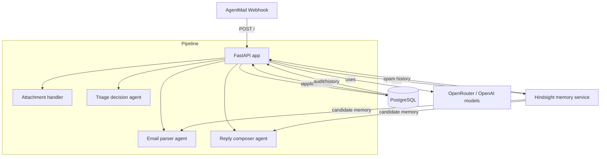

# Hindsight Integration Report

## 1. What is Hindsight

Hindsight is a memory service that lets this agent store and retrieve contextual information across email interactions. In this project, it solves the statelessness problem: the HR triage agent can now remember candidate history and spam history across multiple webhook events, instead of treating every incoming email as a brand-new request.

## 2. How we integrated it

### Initialization

In `main.py` we initialize Hindsight at process startup:

```python
from hindsight_agno import HindsightTools, memory_instructions, configure

HINDSIGHT_API_URL = os.getenv("HINDSIGHT_API_URL", "http://localhost:8888")
HINDSIGHT_API_KEY = os.getenv("HINDSIGHT_API_KEY", "")

configure(
    hindsight_api_url=HINDSIGHT_API_URL,
    api_key=HINDSIGHT_API_KEY,
)
```

- `configure(...)` sets the Hindsight client endpoint and API key.
- `HINDSIGHT_API_URL` is defaulted to `http://localhost:8888` and should point to the running Hindsight service.
- `HINDSIGHT_API_KEY` is required in production.
- `memory_instructions` is imported but not used in `main.py`.

### Tool factory and caching

We use a simple cache to avoid rebuilding client instances:

```python
_hindsight_tools_cache: dict[str, HindsightTools] = {}

def get_hindsight_tools(bank_id: str, **kwargs) -> HindsightTools:
    if bank_id not in _hindsight_tools_cache:
        _hindsight_tools_cache[bank_id] = HindsightTools(bank_id=bank_id, **kwargs)
    return _hindsight_tools_cache[bank_id]
```

- Input: `bank_id` and optional kwargs.
- Output: cached `HindsightTools` instance.
- Why: avoid recreating Hindsight client objects on every request.

### Candidate memory bank

```python
def get_candidate_memory_tools(candidate_email: str) -> HindsightTools:
    return get_hindsight_tools(
        f"candidate:{candidate_email}",
        enable_retain=True,
        enable_recall=True,
        enable_reflect=True,
    )
```

- `bank_id` pattern: `candidate:{email}`
- Enables retain, recall, and reflect for candidate-specific memory.
- Used for profile/context retrieval and storing candidate-specific summaries.

### Spam memory bank

```python
def get_spam_tools() -> HindsightTools:
    return get_hindsight_tools("spam-registry")
```

- `bank_id`: `spam-registry`
- Used for cross-session spam history.
- No explicit enable flags are passed, so it uses the library defaults.

### Spam recall before processing

```python
result = get_spam_tools().recall_memory(
    run_context=None,
    query=f"sender {sender} spam complaints history",
)
```

- Input: sender email query string.
- Output: memory text or empty string.
- Why: prevents known bad actors from being processed again.

### Spam retention when spam is detected

```python
get_spam_tools().retain_memory(run_context=None,
    content=f"Sender {sender} flagged as spam because of keyword '{keyword}' on {datetime.now(timezone.utc)}"
)
```

- Input: spam incident text.
- Output: stored memory in `spam-registry`.
- Why: preserve spam evidence for future recall and blocking.

### Candidate memory for email parsing

```python
memory_summary = tools.reflect_on_memory(
    run_context=None,
    query="Summarize candidate profile, skills, submitted documents, previous conversations, and missing information."
)
```

- Input: query asking for candidate profile summary.
- Output: summarized previous candidate memory.
- Why: add historic context to the email parser prompt so the AI can make decisions using past interactions.

### Resume score memory retention

```python
tools = get_candidate_memory_tools(sender)
tools.retain_memory(
    run_context=None,
    content=(
        f"Resume scored {score_result.get('overall_score')}/100. "
        f"Strengths: {score_result.get('strengths')}. "
        f"Weaknesses: {score_result.get('weaknesses')}.
    )
)
```

- Input: resume score summary text.
- Output: stored candidate memory entry.
- Why: preserve the resume evaluation result for later use or analysis.

### Candidate communication style memory retrieval

```python
candidate_context_raw = tools.reflect_on_memory(
    run_context=None,
    query="Summarize candidate communication style, tone, previous replies, and conversation behavior."
)
```

- Input: query for communication style.
- Output: text summary used in reply composition.
- Why: make follow-up replies more consistent with how the candidate has communicated.

### Reply audit memory retention

```python
tools.retain_memory(
    run_context=None,
    content=(
        f"Sent reply on {datetime.now(timezone.utc)}. "
        f"Application status: {state.status}. "
        f"Missing fields requested: {missing_fields}. "
        f"Reply summary: {reply_text[:300]}"
    )
)
```

- Input: reply summary and status metadata.
- Output: stored candidate memory entry.
- Why: keep a record of what the agent requested and sent.

## 3. Architecture diagram



## 4. Memory banks

| bank_id pattern | What gets stored | Who reads it |
|---|---|---|
| `candidate:{email}` | Candidate profile summary, missing information, resume score, reply history, communication tone | `get_candidate_memory_context`, reply composition path, final reply retention, resume score retention |
| `spam-registry` | Spam flags and keyword-based spam incidents | `check_candidate_history`, `detect_spam` |

## 5. What the agent can do now that it couldn't before

- Before: every incoming email was processed without any knowledge of earlier messages from the same candidate.
  After: the email parser receives a candidate memory summary prior to parsing, so it can factor in prior missing fields and document submissions.

- Before: spam detection was only keyword-based in the current message.
  After: the agent can block senders with a remembered spam history from `spam-registry` even if the new message does not contain a known spam keyword.

- Before: replies were generated without any candidate-specific communication context.
  After: the reply composer can read candidate tone and history from Hindsight and produce follow-up text that is more aligned with past interactions.

- Before: resume scoring results were ephemeral and lost after the request.
  After: approved candidate resume scores are retained in candidate memory for later analysis or future prompts.

## 6. Known limitations

- `memory_instructions` is imported from `hindsight_agno` but not used. That import should be removed or connected to prompt guidance.
- The Hindsight cache is unbounded. `get_hindsight_tools` stores every new `bank_id` forever in `_hindsight_tools_cache`, so a high volume of unique candidate emails can grow memory usage.
- Candidate memory is only summarized via `reflect_on_memory`; there is no structured schema enforcement on the returned summary.
- If Hindsight is slow or unavailable, `reflect_on_memory`, `recall_memory`, or `retain_memory` calls can delay processing in the background thread.
- The code does not explicitly handle Hindsight API failures at the top-level `configure(...)` call.
- `spam-registry` is not used for any advanced spam classification beyond keyword and historical recall.
- If the Hindsight API key is invalid, the service may still start but memory operations will fail at runtime.
- There is no explicit cleanup or graceful close for Hindsight client sessions, which may surface `unclosed client session` warnings in async contexts.
- The integration is currently read/write text only; it does not support structured field storage inside Hindsight.

## 7. How to verify it's working

1. Start the Hindsight service locally and verify it listens on `http://localhost:8888`.
2. Set `HINDSIGHT_API_URL=http://localhost:8888` and a valid `HINDSIGHT_API_KEY` in `.env` or the shell.
3. Start the app with `python main.py` or via Docker compose.
4. Call the health endpoint:

```bash
curl http://localhost:8000/health
```

- Confirm `skills_loaded` is present.
- Confirm `database` is `connected`.

5. Send a simple `message.received` webhook payload to `POST /` that includes `sender`, `thread_id`, `inbox_id`, `message_id`, and `text`.
6. Watch the logs for these lines:

- `Failed to fetch candidate memory` → Hindsight read failed.
- `Resume scored ...` → memory retention after approval.
- `Sent reply on ...` → reply memory retained.

7. In the Hindsight dashboard, verify two bank IDs exist:

- `candidate:<email>` for the test sender.
- `spam-registry` if you have triggered spam retention.

8. In the dashboard, confirm stored entries contain:

- Candidate conversation summary or resume score text.
- A spam flag entry for the sender if spam was detected.

9. If you want to verify memory retrieval directly, send the same candidate email again and confirm the log includes `KNOWN CANDIDATE FACTS FROM PREVIOUS INTERACTIONS:` in the parser prompt path.

## 8. Environment variables

| Name | Purpose | Required | Example |
|---|---|---|---|
| `HINDSIGHT_API_URL` | URL for the Hindsight API server | Yes in production, defaulted locally | `http://localhost:8888` |
| `HINDSIGHT_API_KEY` | API key used to authenticate with Hindsight | Yes | `sk_live_abc123` |

## 9. How to run locally

### Windows Docker command

Use Docker because the Hindsight server cannot be installed directly on Windows with `pip` due to `uvloop` issues.

```powershell
docker run --rm -p 8888:8888 hindsight-agno/hindsight-api:latest
```

### WSL alternative

From a WSL shell, run the same Docker command:

```bash
docker run --rm -p 8888:8888 hindsight-agno/hindsight-api:latest
```

If you are inside WSL, you can also run it directly from `bash` and then point the Python app at `http://localhost:8888`.

## 10. Troubleshooting

| Error | Cause | Fix |
|---|---|---|
| `401 Invalid API key format` | `HINDSIGHT_API_KEY` is missing or malformed | Set a valid key in `HINDSIGHT_API_KEY` and restart the app |
| `event loop already running` | `uvicorn` / FastAPI async runtime and Hindsight async client conflict | Keep `nest_asyncio.apply()` only if you must run inside an existing loop; avoid double-starting the app in the same process |
| `unclosed client session` | Hindsight client or async HTTP session was not cleaned up properly | Ensure Hindsight client lifecycle is managed by the library and avoid running the app in a nested interpreter session |


> Note: this report is based on the current `main.py` code and the repository dependency list. The core Hindsight integration points are the functions listed above, and the service is used for cross-request memory rather than primary triage logic.
